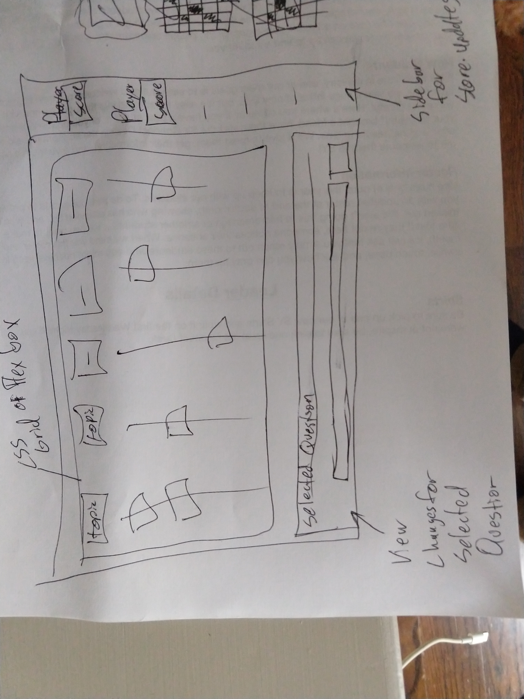

# Jeopardy Project
## Overview
For our first wdi18 project, I decided to build out Jeopardy.

When players enter the site, the Jeopardy board will already be built out with set categories and questions of varying value. When the player clicks on a card, a question panel appears with the associated question and possible answers for the user to choose from. If the user selects the right answer, a message appears telling them they got it correct and then they are awarded the point value of the question. If they get it wrong, they are told the answer was incorrect. After the user has selected a question and answered it, that tile is removed from the board. Once all tiles are removed from the board, the game is over.

**Live site:** [Link](https://kgreen66.github.io/WDI18-project1/)

## Technologies Used
- Languages used - HTML5, Javascript, CSS
- Implemented design with CSS, Javascript, and used a JSON file
- Project planning and user stories - [Trello](https://trello.com/b/0OFvhK2o/wdi18-project-1)
- VSCode and extensions

## Features 
- 5 categories with 5 questions each
- Give points to player for correctly answered questions
- Total the players score at the top of the screen
- Removes tiles that have been answered

## Wireframe

## Future Development
- Make it responsive
- finish adding music and timer for questions
- finish adding capabilities for multiplayer
- finish the code started for a double jeopardy feature
- finish the code started for a round two with double points values
- add the ability for the user to change between different themes
- Final Jeopardy feature